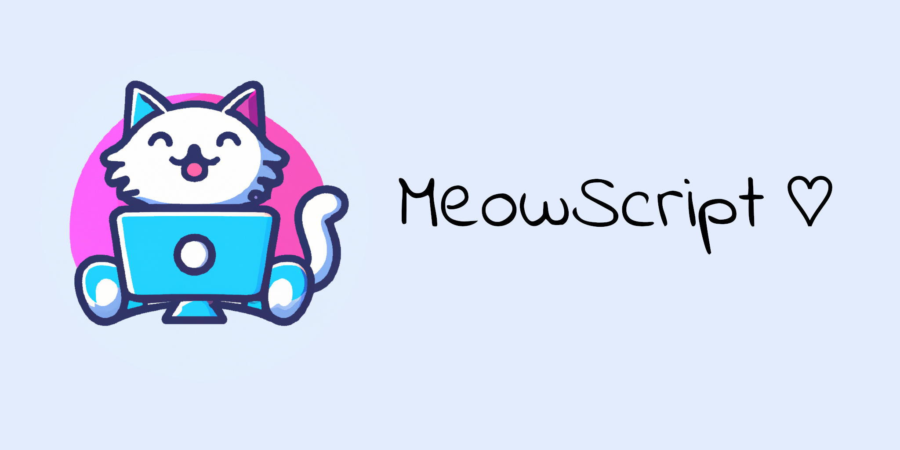

# MeowScript



<div id="badges">
   
</div>
  

A small interpreted, easy extendable programming language.  

## Requirements
|             | Compiler          | BuildTool     | Recomendet|
|-------------|-------------------|---------------|-----------|
| Linux       | gcc/clang         | cmake         |  -------  |
| Windows     | mingw64-gcc/clang | nmake & cmake |   Msys2   |
| MaxOS       | ---------         | ----------    |  -------  |

## Installing
Execute this commands in your shell to download and build MeowScript.
```
$ git clone https://github.com/LabRicecat/MeowScript.git
$ cd MeowScript
$ mkdir build
$ cd build
$ cmake ..
$ make
```
Now you can run the interpreter!
```
$ meow-script --help
```

## How to use
Get started **[here](https://github.com/SirWolfi/MeowScript/wiki)** to learn more about MeowScript!

## Try it out
You can try out MeowScript live by using the `--shell` option or make a `main.mws` and run it with
```
$ meow-script main.mws
```

## Credits
Cute cat on the PC by DALL-E 2.0
